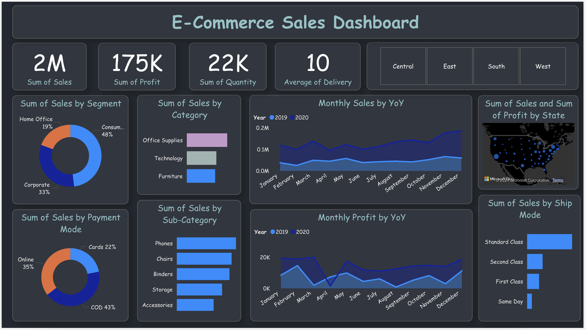

# E-Commerce Sales Dashboard

This Power BI dashboard provides an in-depth analysis of e-commerce sales across different categories, regions, and time periods. It helps stakeholders to visualize sales performance, profit trends, and shipping methods, giving insights into how various segments of the business are performing.

## Dashboard Overview

### [Click here to view the live Power BI dashboard](https://app.powerbi.com/groups/me/reports/cfbab9d8-3958-42b8-84bf-86ab46baa609/915c0a245b881c38b007?experience=power-bi)

### Key Metrics

1. **Total Sales**: Overview of total sales across different time periods and regions.
2. **Total Profit**: Profit generated from e-commerce sales.
3. **Quantity Sold**: Total quantity of items sold over different periods.
4. **Average Delivery Time**: Average time taken to deliver products across various shipping methods.
5. **Sales and Profit by Category**: Detailed breakdown of sales and profit by product categories (e.g., Office Supplies, Technology, Furniture).
6. **Sales by Ship Mode**: Analysis of sales broken down by shipping methods (Standard Class, Second Class, First Class, Same Day).

### Dashboard Features

- **Sum of Sales by Category**: Displays the sales performance by major categories like Office Supplies, Technology, and Furniture.
  
- **Sum of Sales by Sub-Category**: Provides more granular insights into sales by product sub-categories such as Phones, Chairs, Binders, and Storage.
  
- **Sales by Ship Mode**: A detailed view of how shipping methods (Standard Class, First Class, etc.) affect sales volume.
  
- **Sales by Segment**: Highlights the proportion of sales from various customer segments, including Consumer, Corporate, and Home Office.
  
- **Sales by Payment Mode**: Breakdown of payment modes used by customers (Cards, Cash on Delivery (COD), and Online payments).
  
- **Monthly Sales and Profit by Year**: Shows the month-over-month performance of sales and profit for the years 2019 and 2020.
  
- **Sales and Profit by State**: Provides a geographical breakdown of sales and profit across different states in the United States.

## How to Use the Dashboard

1. **Filters**: The dashboard includes filters for time periods, product categories, shipping methods, and customer segments, allowing users to drill down and analyze specific data points.
   
2. **Drill-Down Functionality**: You can click on specific visualizations (e.g., sales by state or category) to explore more detailed, item-level data.

3. **Interactive Map**: A built-in map feature allows users to see sales and profit distribution across states visually.

4. **Monthly Performance Tracking**: Use the year-over-year monthly sales and profit charts to monitor performance trends over time.

## Data Sources

The dashboard is powered by sales data from an e-commerce platform, covering:
- **Product Categories and Sub-Categories**: Such as Office Supplies, Technology, and Furniture.
- **Sales and Profit Data**: Year-over-year sales and profit figures.
- **Shipping Information**: Data on shipping methods and their impact on delivery time and sales.
- **Customer Segments**: Sales performance across Consumer, Corporate, and Home Office segments.
- **Payment Modes**: Transactions categorized by payment method.

## Visualizations

- **Bar Charts**: Used to compare sales and profit across product categories, sub-categories, states, and customer segments.
- **Line Charts**: Display monthly sales and profit trends year-over-year (YoY).
- **Pie Charts**: Visualize the proportion of sales by payment mode and customer segment.
- **Maps**: Shows geographical distribution of sales and profit.

## Technology Stack

- **Power BI**: Used to create interactive visualizations and share insights.
- **Data Sources**: CSV and Excel files of sales and performance data, integrated into Power BI.

## Getting Started

To explore the dashboard:
1. Click on the [live Power BI dashboard link](https://app.powerbi.com/groups/me/reports/cfbab9d8-3958-42b8-84bf-86ab46baa609/915c0a245b881c38b007?experience=power-bi).
2. Use the filters on the right-hand side to narrow down your focus based on category, state, segment, and time period.
3. Explore the interactive charts by hovering over data points for more details.

## Contributing

If you want to contribute to the development of this dashboard:
1. Fork the repository.
2. Make your changes to the `.pbix` file.
3. Submit a pull request with your improvements.

## License

This project is licensed under the MIT License. See the `LICENSE` file for more details.

---

### Dashboard Preview

